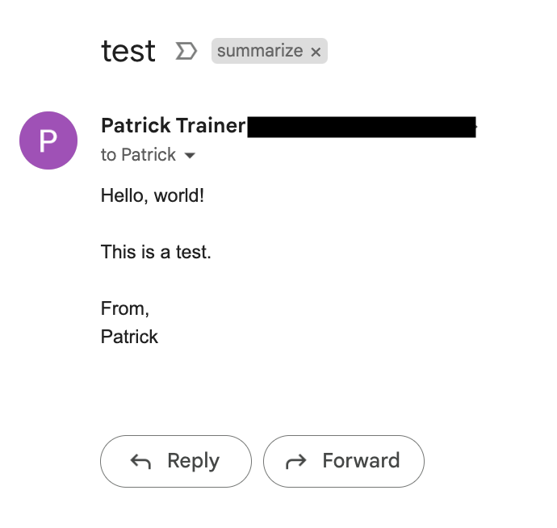

## Description:

This AppScript script is designed to summarize emails in your Gmail inbox. 

It utilizes the OpenAI `GPT-3.5-turbo` model to generate summaries of the emails that match a certain filter criterion (i.e., starred and labeled as "summarize").

### Example of a summarized email

Turns this email 



Into this json response from OpenAI

```json
{
  "id": "chatcmpl-xxx-xxx-xxx-xxx",
  "object": "chat.completion",
  "created": 1697841524,
  "model": "gpt-3.5-turbo-0613",
  "choices": [
    {
      "index": 0,
      "message": {
        "role": "assistant",
        "content": "Summary: Patrick is sending a test email."
      },
      "finish_reason": "stop"
    }
  ],
  "usage": {
    "prompt_tokens": 35,
    "completion_tokens": 9,
    "total_tokens": 44
  }
}
```

From here, you can send the response to your phone or other device for quick review.

## Features

**Post Message to OpenAI:** The script sends the content of the email to the OpenAI API for summarization.

**Search Gmail:** It can search your Gmail inbox based on a given query.

**Process Emails:** The script will look for emails that are starred and have the label `summarize`. Once the email is summarized, the star is removed.

## Setup

**API Key:** Ensure you have an active OpenAI API key. The script currently has a placeholder. Replace `OPENAI_API_KEY` with your own key.

```javascript
const OPENAI_API_KEY = "YOUR_OPENAI_API_KEY";
``````

**Gmail Filters:** The script operates on emails that are both starred and labeled as "summarize". Set up a filter in your Gmail to star and label emails that you want summarized.

## How to Use

1. Run `main()` 
2. The script will fetch all emails that are starred and have the label "summarize".
3. For each email that matches the criteria, it will send the content to OpenAI for summarization.
4. Once processed, the star will be removed from the email.


## Notes

Make sure to handle your API key with care. Do not share or expose it.
